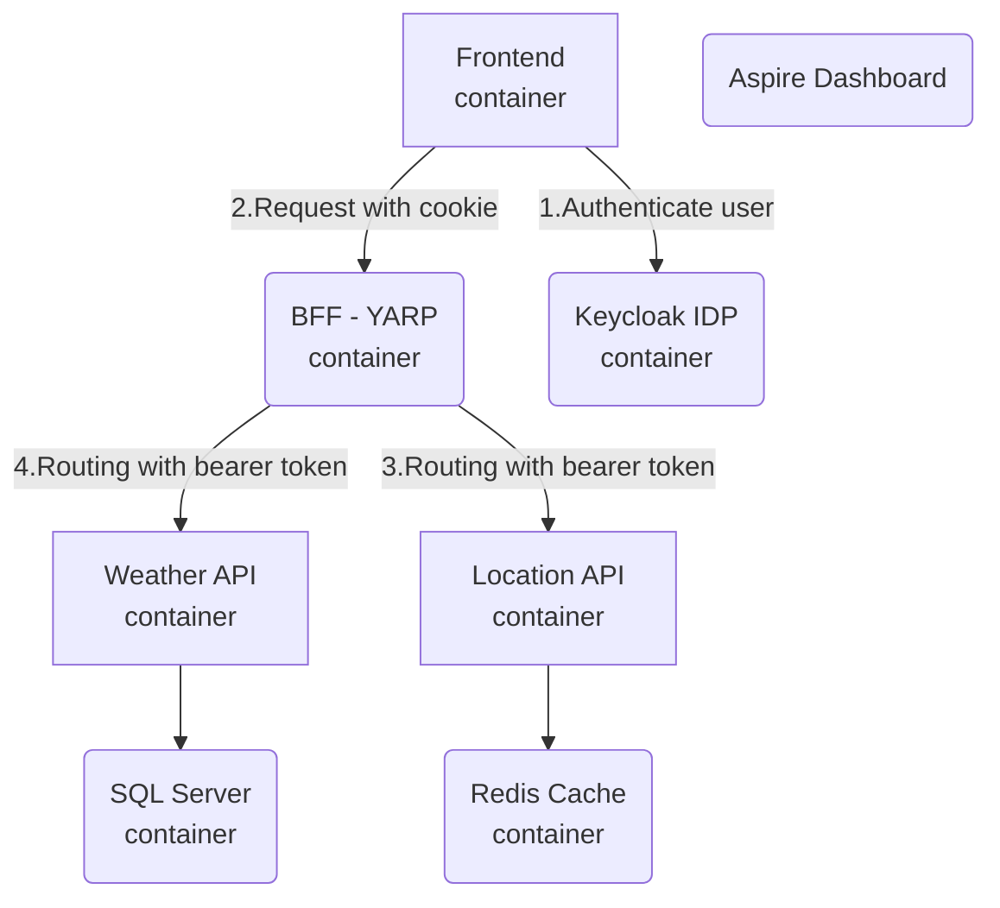

# Demo 28.1.2025

## Table of Contents

### 1. Demo App Overview
- 1.1 Solution Architecture 
- 1.2 Frontend + Aspire Dashboard
- 1.3 Development experience (monorepo)

### 2. .NET Aspire App Model (SDK)
- 2.1 Introduction of different Resource Types
    - Container
    - Projects
    - Executables
    - Azure Resources
- 2.2 .NET Aspire App Model
    - Dependency management
    - Environment Variables
    - YAML and Bicep configuration model for Azure Container Apps
        - azd infra synth
        - YAML
        - Bicep (Aspire.Hosting.Azure.AppContainers extension)
        - Limitations (examples)
            - Container App CPU / Memory (Bicep/YAML)
            - Container App Environment (Bicep)
    - Change other Azure resources (Bicep modules) via App Model
        - ConfigureInfrastructure()
    - Include Bicep modules to App Model
        - AddBicepTemplate()

### 3. Service Discovery (optional)
- 3.1 Introduction of Service Defaults Project
- 3.2 Implicit service discovery by reference
- 3.3 Service Discovery configuration (Authentication, YARP)

### 4. Application Configuration and Pipeline (optional)
- 4.1 Configuration options
    - Run application locally => appsettings.development.json
    - Local deployment (azd up) => Local .env files + Config.json (secured params)
    - Deployment pipeline (azd up in ado) => Variable groups
        - $(AZD_INITIAL_ENVIRONMENT_CONFIG)

## .NET Aspire Solution Architecture




### Scaling


```
  template:
    containers:
    - image: {{ .Image }}
      name: weather-api
      resources:
          cpu: 1
          memory: 2Gi
```
```
 resources:{
            cpu: 1
            memory: '2Gi'
          }
```