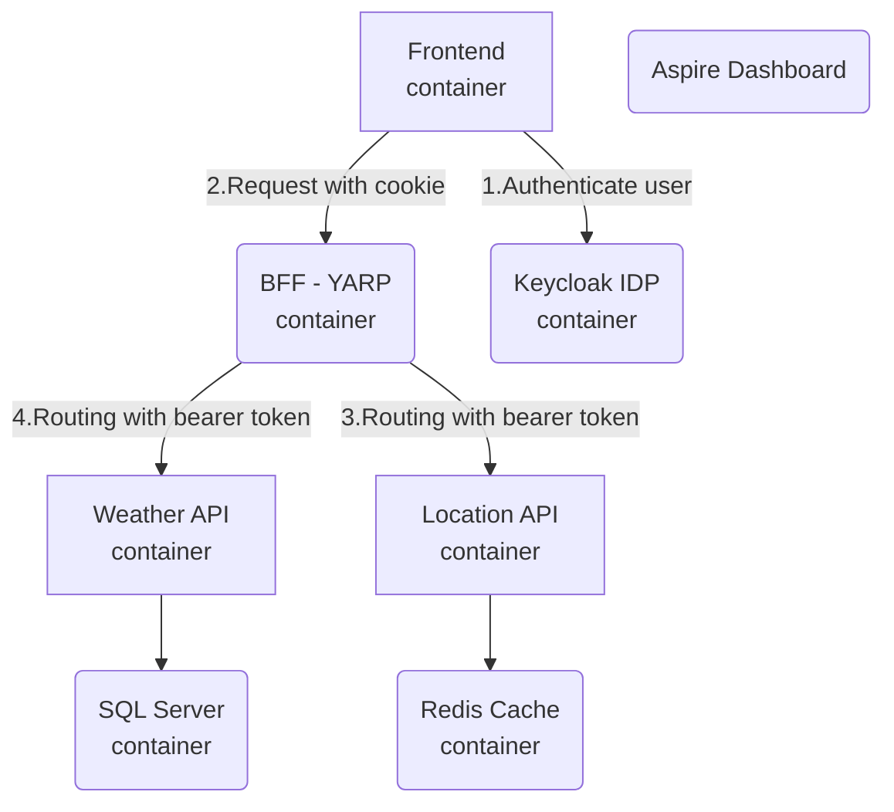

# Faug.Demo

This solution was used for demo purposes in the Finland Azure User Group on 28.1.2025.

## .NET Aspire Solution Architecture



## Initial config

### 1. Add the following appsettings.json configuration to Faug.Demo.AppHost project:

```
{
  "Logging": {
    "LogLevel": {
      "Default": "Information",
      "Microsoft.AspNetCore": "Warning"
    }
  },
  "Parameters": {
    "keycloak-username": "admin",
    "keycloak-password": "Pa33w0rd!",
    "weather-db-admin-password": "Pa33w0rd!",
    "weather-db-server-name": "weather-db-server",
    "weather-db-name": "weather-db",
    "frontend-client-secret": "ElR6HzbI6r7GPkFUAnX7E41l2M63fXKi"
  }
}
```
### 2. Run the solution locally

- Open the Keycloak Admin UI
    - Username: admin
    - Password: Pa33w0rd!
- Click Clients
- Import client
    - Get configuration from the Faug.Demo.AppHost\keycloak\frontend.json and upload it.
    - Enable Client authentication
    - Save
    - Open Credential tab
    - Copy Client Secret to clipboard

### 3. Stop solution
- Open appsettings.json and replace "frontend-client-secret" value with this new client secret. 

### 4. Run solution again
- Login to Frontend solution https://localhost:3443/
    - Username: admin
    - Password: Pa33w0rd!
